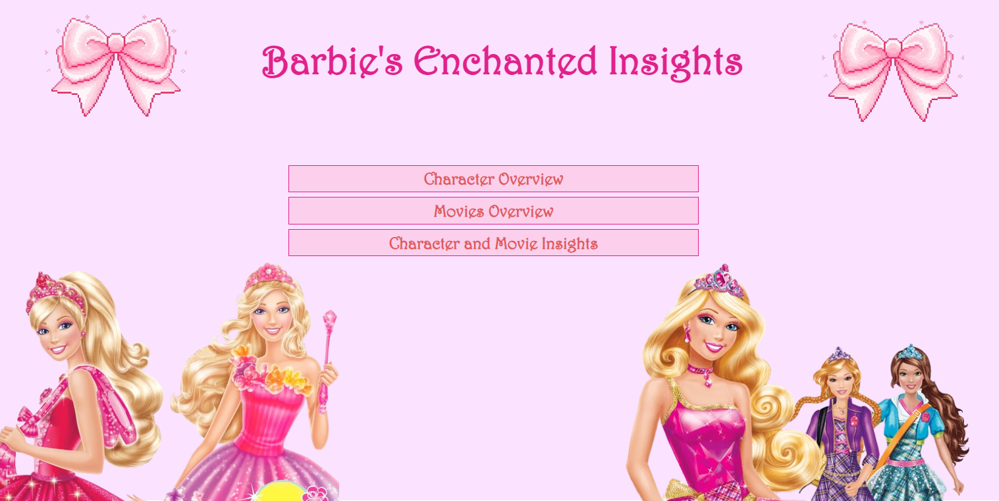
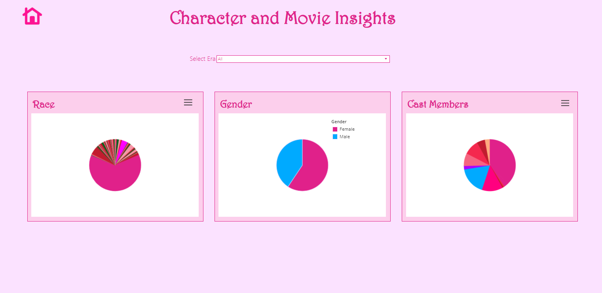
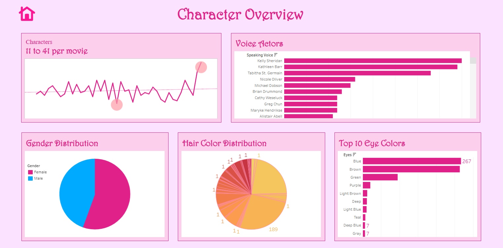
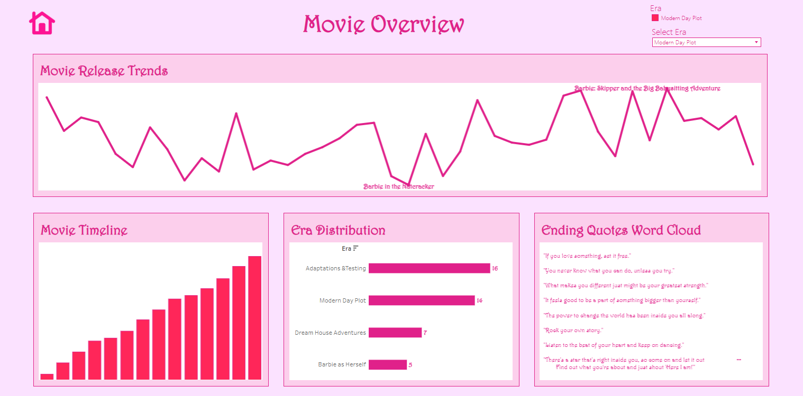

# 💕 Barbie Enchanted Insights ✨
*A data-powered deep dive into the world of Barbie movies and characters!*

## 👑 About the Project
Barbie isn’t just a doll — she’s a data icon.  
This Tableau dashboard explores trends across Barbie movies and characters, highlighting themes, appearances, and insights only Barbie fans would *truly* appreciate.  

> 📍 Built using Tableau  
> 💡 Data collected and cleaned manually from Barbie movies  
> 🛍️ Topics covered: character frequency, movie insights, cross-character analysis, and more!

## 📊 Explore the Dashboard

🔗 [Click here to view it on Tableau Public](https://public.tableau.com/app/profile/mariam.rehan/viz/BarbieEnchantedInsights/MainPage)

### 🌸 Dashboard Sections
1. **Main Page** — a magical welcome ✨  
2. **Character Overview** — top characters, appearances, and types  
3. **Movie Overview** — movie frequency, popularity, and magic themes  
4. **Character + Movie Insights** — which characters dominate, and what patterns emerge

---

## 🧠 Why I Made This
I wanted to blend pop culture with analytics — showing that data storytelling can be fun, feminine, and fierce. Barbie has been a cultural icon for decades, and her movies deserve to be celebrated with the same passion we bring to business dashboards!

---

## 💅 Aesthetic Preview

| Main Page | Character + Movie Insights |
|--------------------|----------------|
|  |  |

| Character Overview | Movie Overview |
|--------------------|----------------|
|  |  |

---

## 🦄 Let's Connect!
Made with 💖 by [Mariam Rehan](https://www.linkedin.com/in/mariam-rehan)

